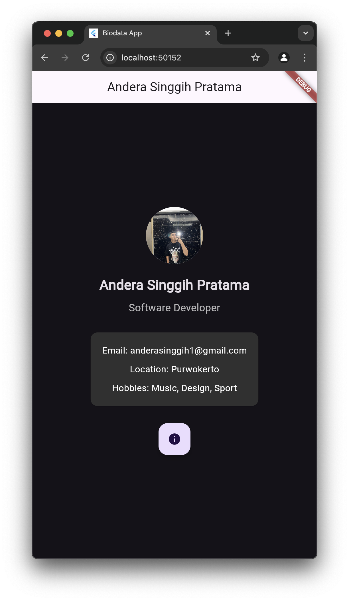

### Apa itu Dart?

Dart adalah bahasa pemrograman yang dikembangkan oleh Google. Ini dirancang untuk membangun aplikasi yang dapat berjalan di berbagai platform, termasuk web, mobile, dan desktop. Dart memiliki beberapa fitur utama:

- Tipisasi Statik: Menyediakan keamanan tipe yang lebih baik dengan memeriksa tipe data pada waktu kompilasi.
- Asynchronous Programming: Memudahkan penanganan operasi yang memerlukan waktu, seperti pengambilan data dari API, menggunakan `async` dan `await`.
- Berorientasi Objek: Dart adalah bahasa berorientasi objek yang mendukung konsep seperti kelas, objek, pewarisan, dan polimorfisme.

### Apa itu Flutter?

Flutter adalah framework UI yang juga dikembangkan oleh Google, yang memungkinkan pengembang untuk membuat aplikasi dengan satu basis kode untuk berbagai platform, termasuk iOS, Android, web, dan desktop. Flutter menggunakan Dart sebagai bahasa pemrogramannya. Beberapa keunggulan Flutter meliputi:

- Hot Reload: Memungkinkan pengembang melihat perubahan kode secara langsung tanpa kehilangan status aplikasi, mempercepat proses pengembangan.
- Widget: Segala sesuatu di Flutter adalah widget, dari elemen UI dasar hingga layout kompleks. Ini memungkinkan fleksibilitas dan kemudahan dalam menciptakan antarmuka pengguna yang menarik.
- Kinerja Tinggi: Flutter berkompilasi langsung menjadi kode native, sehingga aplikasi yang dihasilkan memiliki performa yang sangat baik.

### Contoh Widget di Flutter

Berikut adalah beberapa contoh widget yang umum digunakan dalam Flutter:

1. Container: Widget dasar yang digunakan untuk mengatur layout dan tampilan, dapat diatur ukuran, warna, dan padding-nya.

2. Text: Digunakan untuk menampilkan teks. Memungkinkan pengaturan gaya seperti ukuran, warna, dan font.

3. Row: Widget yang mengatur anak-anaknya dalam baris secara horizontal. Berguna untuk membuat layout yang teratur.

4. Column: Mirip dengan `Row`, tetapi mengatur anak-anaknya secara vertikal. Cocok untuk membuat daftar elemen yang saling berurutan.

5. Scaffold: Memberikan struktur dasar untuk aplikasi, termasuk `AppBar`, `Body`, dan elemen lainnya, sehingga memudahkan dalam membuat tampilan aplikasi.

6. ListView: Widget untuk menampilkan daftar yang dapat digulir. Berguna untuk menampilkan koleksi data dalam format yang teratur.

7. Card: Widget yang memberikan efek tampilan seperti kartu. Sering digunakan untuk mengelompokkan informasi terkait dalam tampilan yang menarik.

# code

import 'package:flutter/material.dart';

void main() {
runApp(const MyApp());
}

class MyApp extends StatelessWidget {
const MyApp({super.key});

@override
Widget build(BuildContext context) {
return MaterialApp(
title: 'Biodata App',
theme: ThemeData.dark().copyWith(
colorScheme: ColorScheme.fromSeed(
seedColor: Colors.deepPurple,
primary: Colors.deepPurple,
),
useMaterial3: true,
),
home: const MyHomePage(title: 'Andera Singgih Pratama'),
);
}
}

class MyHomePage extends StatelessWidget {
const MyHomePage({super.key, required this.title});

final String title;

@override
Widget build(BuildContext context) {
return Scaffold(
appBar: AppBar(
title: Text(title),
),
body: Center(
child: Column(
mainAxisAlignment: MainAxisAlignment.center,
children: <Widget>[
const CircleAvatar(
radius: 50,
backgroundImage: NetworkImage(
'/lib/img/profile.JPG'), // Replace with your image URL
),
const SizedBox(height: 20),
const Text(
'Andera Singgih Pratama',
style: TextStyle(fontSize: 24, fontWeight: FontWeight.bold),
),
const SizedBox(height: 10),
const Text(
'Software Developer',
style: TextStyle(fontSize: 18, color: Colors.white70),
),
const SizedBox(height: 20),
Card(
margin: const EdgeInsets.all(10),
color: Colors.grey[850], // Dark card background
child: Padding(
padding: const EdgeInsets.all(20),
child: Column(
children: const [
Text(
'Email: anderasinggih1@gmail.com',
style: TextStyle(fontSize: 16, color: Colors.white),
),
SizedBox(height: 10),
Text(
'Location: Purwokerto',
style: TextStyle(fontSize: 16, color: Colors.white),
),
SizedBox(height: 10),
Text(
'Hobbies: Music, Design, Sport',
style: TextStyle(fontSize: 16, color: Colors.white),
),
],
),
),
),
const SizedBox(height: 20),
FloatingActionButton(
onPressed: () {
// Action when pressed
},
tooltip: 'More Info',
child: const Icon(Icons.info),
),
],
),
),
);
}
}

## Preview

