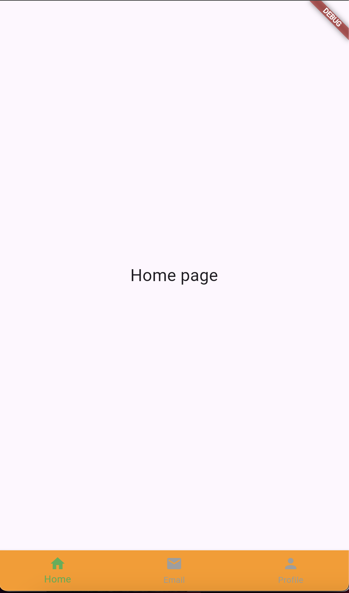
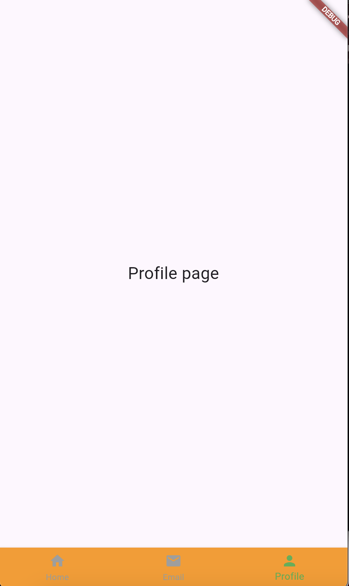
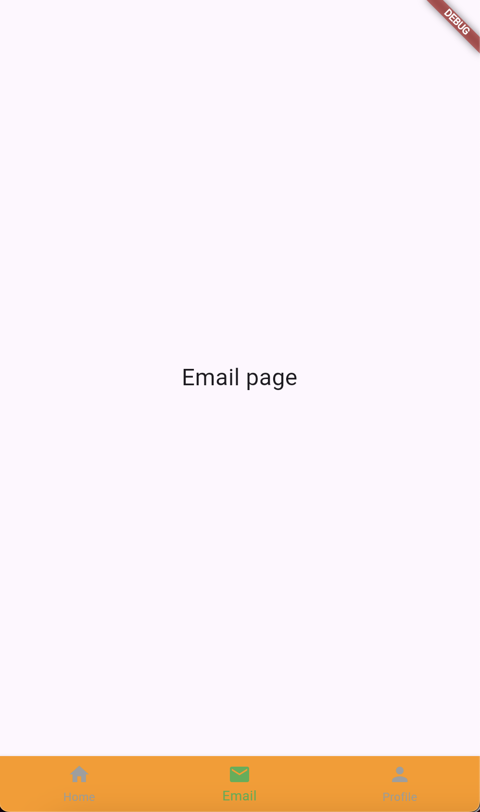

# Cover

<div align="center">
TUGAS PENDAHULUAN<br>
PEMROGRAMAN PERANGKAT BERGERAK <br>
<br>
MODUL VI <br>
INTERAKSI PENGGUNA<br>


<br>

Disusun Oleh: `<br>`
Andera Singgih Pratama/2211104007 `<br>`
SE-06-01 `<br>`

<br>

Asisten Praktikum : `<br>`
Muhammad Faza Zulian Gesit Al Barru `<br>`
Aisyah Hasna Aulia `<br>`

<br>

Dosen Pengampu : `<br>`
Yudha Islami Sulistya, S.Kom., M.Cs `<br>`

<br>

PROGRAM STUDI S1 REKAYASSA PERANGKAT LUNAK `<br>`
FAKULTAS INFORMATIKA `<br>`
TELKOM UNIVERSITY PURWOKERTO `<br>`

</div>

# Soal Nomor 1

## Source Code:

```
import 'package:flutter/material.dart';

void main() {
  runApp(MyApp());
}

class MyApp extends StatefulWidget {
  const MyApp({super.key});

  @override
  _MyAppState createState() => _MyAppState();
}

class _MyAppState extends State<MyApp> {
  // Controller for PageView
  final PageController _pageController = PageController();
  int _selectedIndex = 0;

  // Function to handle page navigation
  void _onItemTapped(int index) {
    setState(() {
      _selectedIndex = index;
      _pageController.animateToPage(index,
          duration: const Duration(milliseconds: 300), curve: Curves.easeInOut);
    });
  }

  @override
  Widget build(BuildContext context) {
    return MaterialApp(
      home: Scaffold(
        // SafeArea to prevent overlapping with status bar
        body: SafeArea(
          child: PageView(
            controller: _pageController,
            onPageChanged: (index) {
              setState(() {
                _selectedIndex = index;
              });
            },
            children: const [
              // Pages for Home, Email, and Profile
              Center(child: Text('Home page', style: TextStyle(fontSize: 24))),
              Center(child: Text('Email page', style: TextStyle(fontSize: 24))),
              Center(
                  child: Text('Profile page', style: TextStyle(fontSize: 24))),
            ],
          ),
        ),
        // Bottom Navigation Bar
        bottomNavigationBar: BottomNavigationBar(
          items: const <BottomNavigationBarItem>[
            BottomNavigationBarItem(
              icon: Icon(Icons.home),
              label: 'Home',
            ),
            BottomNavigationBarItem(
              icon: Icon(Icons.email),
              label: 'Email',
            ),
            BottomNavigationBarItem(
              icon: Icon(Icons.person),
              label: 'Profile',
            ),
          ],
          currentIndex: _selectedIndex,
          selectedItemColor: Colors.green,
          unselectedItemColor: Colors.grey,
          backgroundColor: Colors.orange,
          onTap: _onItemTapped,
        ),
      ),
    );
  }
}

```

## Screenshot Output: `<br>`





## Deskripsi

Aplikasi sederhana ini dibuat dengan tiga halaman utama: Home, Profile, dan Email, yang bisa dipilih menggunakan bottom navigation bar di bagian bawah layar. Ketika aplikasi dibuka, halaman Home muncul sebagai halaman awal. Pengguna bisa berpindah halaman dengan mengetuk ikon di navigation bar tersebut. Misalnya, jika pengguna mengetuk ikon "Wisata", halaman akan berubah untuk menampilkan teks "Ini Halaman Wisata".
